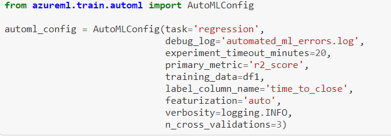
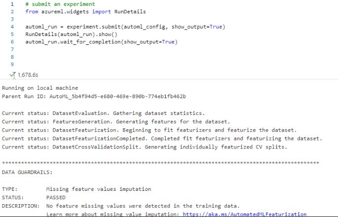
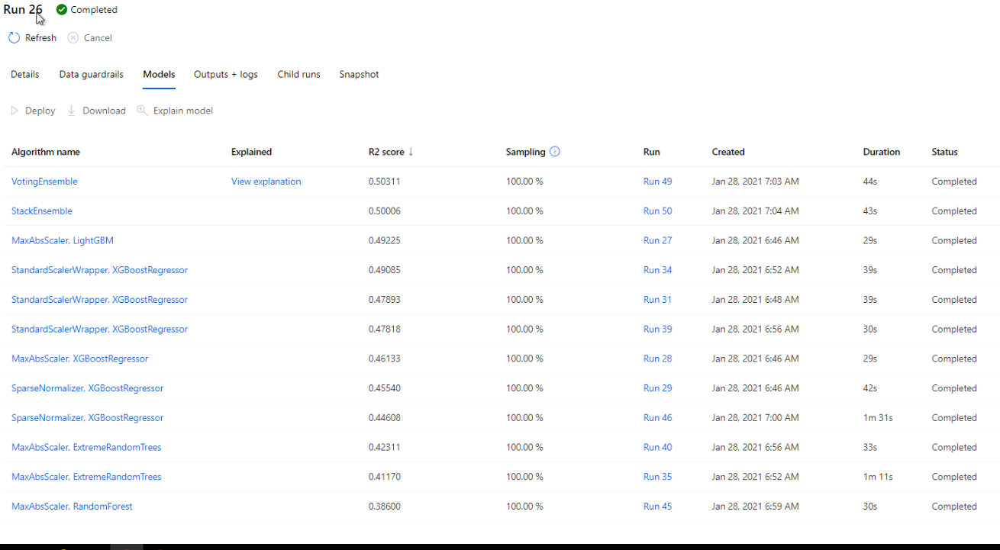
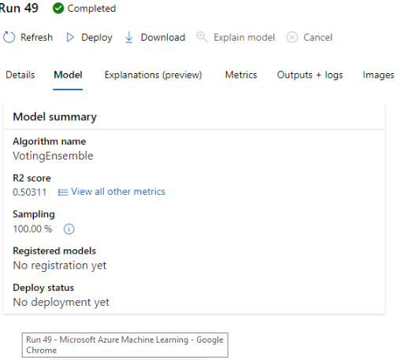
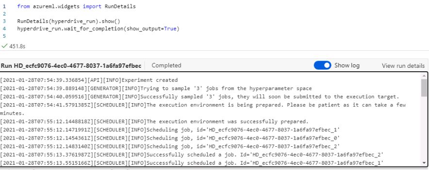
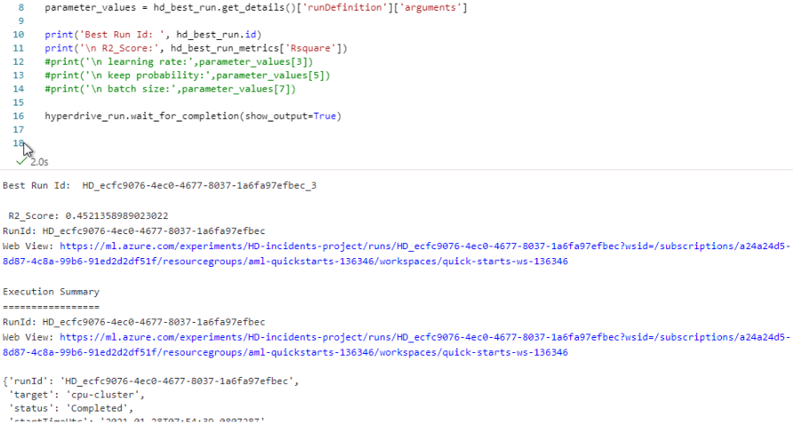
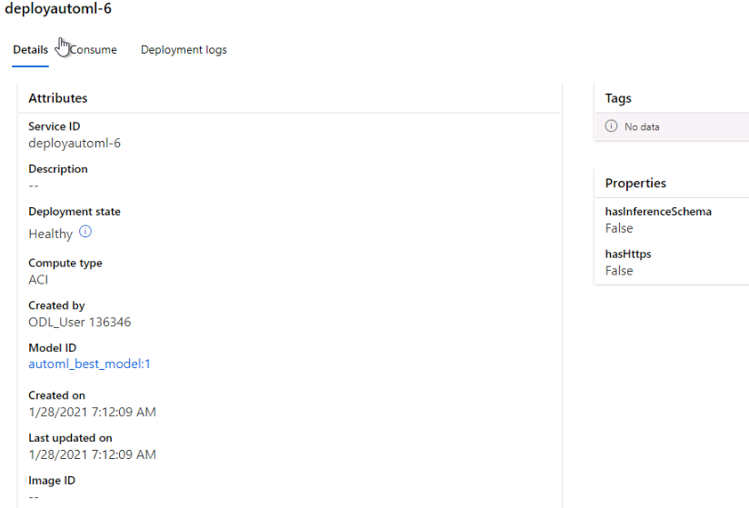
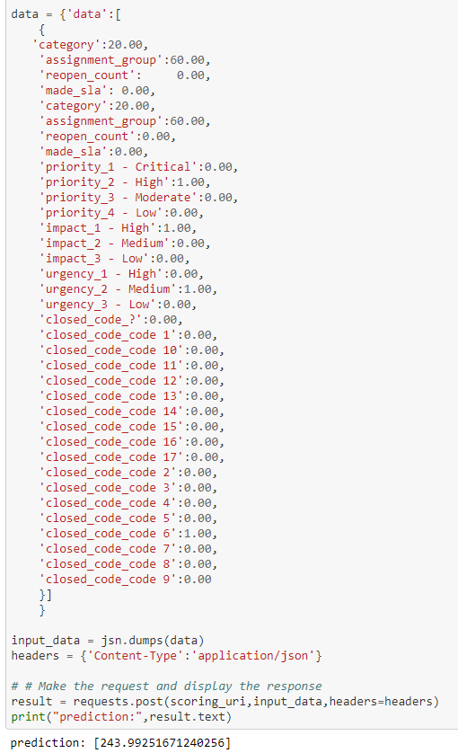

# Azure-ML-Capstone

## Incident Management Process - Event Log

Incident management is the process used by DevOps and IT Operations teams to respond to an unplanned event or service interruption and restore the service
Incidents that cannot be resolved quickly by the help desk will be assigned to specialist technical support groups. 
A resolution or work-around should be established as quickly as possible in order to restore the service.

The dats is taken from s Servicenow instance of ITSM ( IT Service Management) . It provides details of the incident and it's characteristics and tells when the issue is resolved or closed by specilist . In this project , I am trying to predict the time taken for incident to close or resolve, so that the requester will be informed upfront.
Also it helps to analyze if the incident wil miss SLA ( service level agreement ) in such cases , there will be a scope to take preventive action by mobilizing the suitable resources.

Project Set Up and Installation
OPTIONAL: If your project has any special installation steps, this is where you should put it. To turn this project into a professional portfolio project, you are encouraged to explain how to set up this project in AzureML.

## Dataset

### [Dataset](https://archive.ics.uci.edu/ml/machine-learning-databases/00498/)
Overview
The incident management log data is retrieved from UCI Machine learnig data set. [Incident Data)https://archive.ics.uci.edu/ml/datasets/Incident+management+process+enriched+event+log. The data is sourced from a Servicenow platform for IT service management.

This provides details of various incidents recorded over period of time. I have taken up this project to predict ETA(expected time of accomplishment) to understand time to resolve each incident. This helps IT department to provide ETA for customers based on time taken to resolve similar issues historically. This will also help IT department to understand if any instance will go beyond expected SLA.

#### Dataset details
 - Number of instances   : 141712
 - No of Characteristics : 36
 - Dataset Type          : Characteristics
 - Dependent Variable    : Time to close 
   
#### Task
This event log is extracted from an instance of Servicenow
Some of the important attributes are 
- Incident Number :        An identifier of incident
- Incident State :         The status of incident in its life cycle like : created, open , assigned , resolved , closed etc..
- Category, Sub category : Helps to identify or classify the type of incident
- Impact :                 Provides if it has high , medium or low impact
- Urgency , Priority :     provides Urgency and priority of the incident to resolve
- Created on , opened on:  The timestamp of created date / opened date of incident
- resolved on, closed on : Provides the timestamp details of the progress to resolve or close the task.

**Target Variable**

**Time to close :**       The calculated variable to get time needed to close the task in hours 
                           This is calculated as difference between time to close and time to create a task .

** Access
The data is accessed from url : https://archive.ics.uci.edu/ml/datasets/Incident+management+process+enriched+event+log
The CSV file is extracted from Zip file obtained form the URL.
The incidents that have the status as 'closed' are considered for model to predict time to close an incident.
The sample data set used is : 
   
   
   

## Automated ML
Auto ML is used to train the model and view the results of the metrics obtained.

The following tasks are done :

- Connectyour workspaceand createan experiment 
- Load data and train scikit-learn models
- View training results in thestudio
- Retrievethe best model

## Connect workspace and create experiment
A computetarget is cretaed to specify the computeresource to run your training script or hostyour service

Compute is creatd and configuration details is obtained 

AUTO ML configuration is created

   PROPERTY             | VALUE   | DESCRIPTION
------------------------|----------|-------------------------------------------------------------
experiment_timeout_minutes|  20     | Maximum amount of timein minutes
primary_metric            |R2 Score | R2 Score
featurization             | auto    | To handel theinput data (handling missing data, converting text to numeric, etc.)
verbosity                 |logging.INFO| Controls thelevel of logging.
n_cross_validations       |3        |Number of cross-validation splits

### Auto ML experiment is submitted and it has resulted in folowing runs

### Create and run the experiment

## Experiments

## Various runs of AutoML are:

# Auto ML Runs:

### The model is trained in various algorithms

### The best AutoML Run is choosen and saved.
Votinng Ensemble is chosen as better algorithm and has given R2 Score as 0.503

## Best Run AutoML saved model :

## Model Summary

### Best run of AUTOML details are:

## HD Run

### Hyperdrive is configured 

### The experiment is created and submitted. Hyperdrive resulted into the following runs

### Hyperdrive Run details

## All child runs are shown as below

### Hyper Drive Metrics

AUTOML has resulted in provided best R2 score as shown below.

### Auto ML Runs best run details

### Best RUn Details

VotingEnsemble is considered the best model, based on the AUC_weighted metric.
We deploy this model,

## Model Deployment

The automated machinelearning interface allows to deploy the best model as a web servicein.
Deployment helps to integrate the model so it can predict on new data and identify potential areas of
opportunity.

To build the environment for ACI, the following is provided:
- A scoring script (score.py) is created to show how to use the model
- A configuration fileto build the ACI
- The model trained.

### The end point for Auto ML model 
An endpoint is an instantiation of the model into a web servicethat can be hosted in the cloud

### Test the endpoint model 

1. Send the data as a JSON array to the web service hosted in ACI.
2. Use the SDK's run API to invoke the service.

## Clean up resources
- delete only the Container Instances deployment by using this API call
service.delete()

Results
TODO: What are the results you got with your automated ML model? What were the parameters of the model? How could you have improved it?

TODO Remeber to provide screenshots of the RunDetails widget as well as a screenshot of the best model trained with it's parameters.

Hyperparameter Tuning
TODO: What kind of model did you choose for this experiment and why? Give an overview of the types of parameters and their ranges used for the hyperparameter search

Results
TODO: What are the results you got with your model? What were the parameters of the model? How could you have improved it?

TODO Remeber to provide screenshots of the RunDetails widget as well as a screenshot of the best model trained with it's parameters.

Model Deployment
TODO: Give an overview of the deployed model and instructions on how to query the endpoint with a sample input.

Screen Recording
TODO Provide a link to a screen recording of the project in action. Remember that the screencast should demonstrate:

A working model
Demo of the deployed model
Demo of a sample request sent to the endpoint and its response
Standout Suggestions
TODO (Optional): This is where you can provide information about any standout suggestions that you have attempted.
